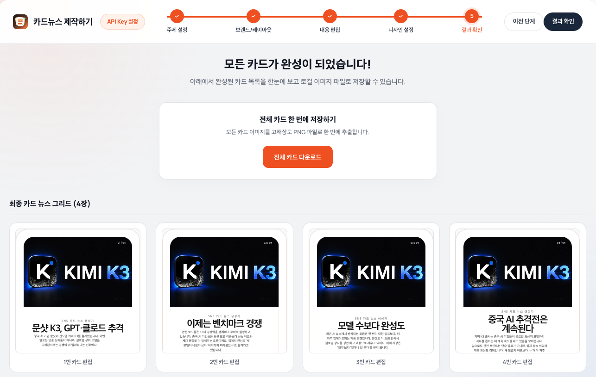

# 카드뉴스 제작하기

주제 입력부터 카드 구성, 디자인 편집, 이미지 저장까지 한 번에 할 수 있는 카드뉴스 제작 도구예요

## 카드뉴스 만들기

- **AI 자동 생성**
  - 주제를 입력하면 카드뉴스 초안을 자동으로 구성해요
  - 카드 흐름은 배경 → 사례 → 핵심 → 결과 → 의미 순서로 잡아요
  - 카드 수, 톤앤매너, 메시지 접근 방식을 선택할 수 있어요
  - OpenAI와 Gemini 중 사용할 AI를 고를 수 있어요

- **직접 작성**
  - 빈 카드부터 제목과 본문을 직접 작성할 수 있어요
  - 필요한 만큼 카드를 추가하고 순서를 조정할 수 있어요

- **뉴스로 시작하기**
  - 오늘의 뉴스에서 카드뉴스로 만들 주제를 고를 수 있어요
  - 기사 요약과 연관 뉴스를 카드 기획에 활용할 수 있어요

## 카드 편집

- 카드마다 제목, 본문, 카테고리, 배지를 수정할 수 있어요
- 카드마다 이미지 또는 영상을 교체할 수 있어요
- 이미지 위치와 확대 비율을 조정할 수 있어요
- 카드별 디자인을 미리 보고 바로 수정할 수 있어요

## 디자인 설정

- 오버레이, 하단 흰색, 하단 검정, 흐름형 카드뉴스 레이아웃을 제공해요
- 브랜드명과 로고를 카드에 넣을 수 있어요
- 대표 색상을 선택하거나 직접 지정할 수 있어요
- 폰트, 카드 규격, 이미지 크롭을 조절할 수 있어요

## 이미지 활용

- 카드 내용에 맞는 이미지 링크를 함께 찾을 수 있어요
- SerpApi를 연결하면 Google 이미지 후보를 카드별로 불러올 수 있어요
- 필요할 때 AI 이미지 생성도 사용할 수 있어요
- 카드별 이미지 후보를 비교하고 원하는 이미지를 적용할 수 있어요

## 저장과 다운로드

- 작업 중인 카드뉴스 초안을 저장하고 다시 불러올 수 있어요
- 완성된 모든 카드를 고해상도 PNG로 한 번에 다운로드할 수 있어요
- 웹에서는 PNG 묶음 ZIP 파일로 받아요
- Apps in Toss 환경에서는 기기 사진첩에 저장할 수 있어요

## 입력 범위

- 주제는 최대 1,000자까지 입력할 수 있어요
- 자동 생성 카드 수는 4장, 6장, 8장, 10장 중에서 선택할 수 있어요
